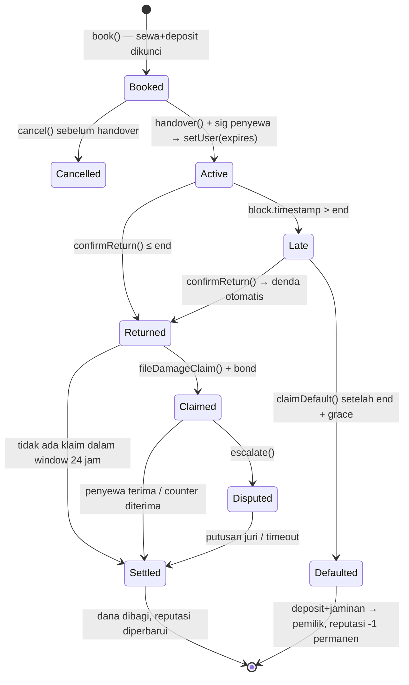
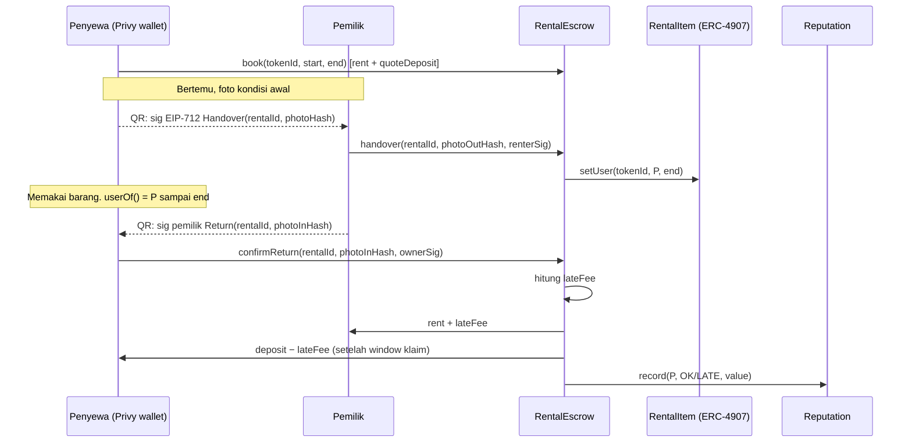

# Rentra: Rencana Build Lengkap (Ethereum Jakarta Hackathon 2026)

*Disusun Jumat, 9 Okt 2026, ±12.00 WIB. Deadline submission: **Sabtu 10 Okt 2026, 12.00 WIB** (target submit 11.30). Track: "BUILD THE REAL WORLD ONCHAIN". Kriteria: Utility 25%, Onchain 25%, Innovation 20%, Feasibility 20%, Demo/UX 10% ([HackQuest](https://www.hackquest.io/hackathons/Ethereum-Jakarta-Hackathon-2026)).*

> **Tagline:** *"Sewa barang tanpa menitipkan KTP. Jaminanmu adalah deposit yang dikunci kode dan reputasimu sendiri."*

---

## 1. Masalah (fakta terverifikasi)

**a. KTP bukan barang jaminan.**
- Dirjen Dukcapil (saat itu Zudan Arif Fakrulloh) menyatakan bahwa **dalam sewa-menyewa kendaraan tidak boleh menahan KTP**. Ia juga menyebut KTP yang ditahan tidak menjamin penyewa kembali, karena pemiliknya cukup melapor hilang dan mengurus KTP baru ([Dagang Berita](https://www.dagangberita.com/hukum/pr-2794995347/ktp-jadi-jaminan-sewa-menyewa-atau-pembantu-di-rumah-apakah-boleh-ini-penjelasan-dirjen-dukcapil-kemendagri)).
- Dukcapil menegaskan (Siaran Pers No. 359, 11 Mei 2026) bahwa fotokopi KTP-el boleh dipakai sepanjang sesuai kebutuhan layanan dan **dikelola secara bertanggung jawab** sesuai **UU 24/2013 (Adminduk)** dan **UU 27/2022 (PDP)**. Dukcapil juga mendorong verifikasi identitas secara elektronik ([Dukcapil Kemendagri](https://dukcapil.kemendagri.go.id/blog/read/ditjen-dukcapil-klarifikasi-pemanfaatan-ktp-el-dan-praktik-fotokopi), [Disdukcapil Berau](https://disdukcapil.beraukab.go.id/berita/detail-luruskan-simpang-siur-ditjen-dukcapil-terbitkan-klarifikasi-terkait-pemanfaatan-ktpel-dan-praktik-fotokopi-524.html), [Kompas](https://www.kompas.com/tren/read/2026/05/12/103000265/dukcapil-klarifikasi-soal-tak-perlu-serahkan-ktp-check-in-hotel-dan)).
- Penahanan KTP di usaha rental dinilai LSM melanggar UU Adminduk dan UU PDP ([Suara Negeri News](https://suaranegerinews.com/daerah/lsm-fiaduru-soroti-praktik-penahanan-ktp-di-usaha-rental-melanggar-uu-administrasi-kependudukan-dan-perlindungan-data-pribadi/)). *(Ini klaim pihak LSM, bukan putusan resmi.)*

**b. Data KTP yang berpindah tangan rawan disalahgunakan.** Berikut contoh kasus pemakaian KTP/KK warga untuk kredit tanpa sepengetahuan pemiliknya:
- Prabumulih: kerugian ±Rp1,8 miliar ([Tribun Sumsel](https://sumsel.tribunnews.com/sumsel/1024595/gunakan-ktp-kk-warga-untuk-ajukan-pinjaman-pria-di-prabumulih-ditangkap-perusahaan-rugi-rp18-m)).
- Kasus kredit dengan identitas 104 debitur yang dipalsukan, kerugian Rp2,66 miliar ([Kartawarta](https://kartawarta.com/berita/korupsi-bri-rp266-miliar-terbongkar-di-pn-bandung-tipikor-bandung-ungkap-modus-104-nasabah)).
- Peringatan bahwa data KTP yang dicuri bisa dipakai untuk pinjol ([Kompas TV](https://origin.kompas.tv/info-publik/566568/waspada-pencurian-data-ktp-untuk-pinjol-ini-bahaya-dan-cara-ceknya)).

**c. Bagi pemilik rental, KTP juga bukan jaminan yang efektif.**
- Bandung (Mar–Apr 2026): dua motor rental digelapkan, pelaku memakai identitas palsu ([PRFM News](https://prfmnews.pikiran-rakyat.com/citizen-report/pr-1310158948/duh-pemilik-rental-motor-di-bandung-ini-jadi-korban-penggelapan-pelaku-kabur-tanpa-kabar)).
- Garut: Honda PCX rental dibawa kabur dengan identitas palsu dan GPS-nya dirusak ([Teras Jabar](https://www.terasjabar.id/penipuan-rental-motor-honda-pcx-polisi-bekuk-aj-di-palmerah-jakarta/)).
- Probolinggo: kamera sewaan dibawa kabur dengan KTP *orang lain* sebagai jaminan ([iNews](https://probolinggo.inews.id/read/650967/wanita-muda-di-probolinggo-bawa-kabur-kamera-sewaan-ktp-orang-dijadikan-jaminan)).
- Kediri: pelaku meninggalkan KTP milik korban kehilangan sebagai "jaminan" ([arahJATIM](https://arahjatim.com/modus-ktp-palsu-berujung-apes-pencuri-scoopy-di-kos-kosan-kediri-diringkus-polisi/)).
- Gowa: 19 mobil rental diduga digelapkan memakai jaminan sertifikat yang diduga palsu ([Media Pesan](https://mediapesan.com/polresta-gowa-ungkap-dugaan-penggelapan-19-mobil-rental-satu-perempuan-diamankan/)).

**Kesimpulan masalah:** jaminan KTP **merugikan dua pihak sekaligus**. Penyewa menanggung risiko data pribadinya disalahgunakan, sementara pemilik tetap tidak terlindungi dari penyewa yang kabur atau memakai identitas palsu. Yang sebenarnya dibutuhkan adalah **jaminan bernilai ekonomi yang bisa dieksekusi otomatis**, ditambah **riwayat perilaku yang bisa diverifikasi**. Keduanya tidak memerlukan data pribadi.

*Contoh kategori barang sewaan sehari-hari (ilustrasi, tanpa klaim statistik): motor, kamera/lensa, alat camping/pendakian, konsol PS, baju adat/kebaya, perlengkapan bayi, proyektor/sound system.*

---

## 2. Produk

### Pengguna
| Persona | Kebutuhan | Pain saat ini |
|---|---|---|
| **Pemilik** (UMKM rental kamera/outdoor, atau individu yang menyewakan barang menganggur) | Barang kembali tepat waktu, kompensasi otomatis jika telat/rusak/hilang | KTP palsu, penyewa kabur, tagih denda manual |
| **Penyewa** (mahasiswa, pendaki, fotografer freelance, keluarga) | Tidak menyerahkan KTP, deposit makin kecil kalau rekam jejaknya baik | Data pribadi ditahan atau difoto, deposit tunai dikembalikan lambat |
| **Penjamin** *(opsional)* | Teman/keluarga yang mau ikut menanggung sebagian deposit | Tidak ada mekanismenya saat ini |

### Alur inti
1. **Daftar barang (pemilik):** foto, nilai barang (Rp), tarif/hari, denda/jam, deposit, grace period. Barang di-mint sebagai `RentalItem` NFT.
2. **Booking (penyewa):** login dengan email/Google (embedded wallet, tanpa seed phrase), pilih tanggal, bayar sewa + deposit (mIDR). Dana dikunci di escrow. **Deposit otomatis lebih kecil jika skor reputasi tinggi.**
3. **Serah terima (bertemu langsung):** pemilik memotret kondisi barang, dan hash foto dicatat. Penyewa scan QR dan menandatangani "barang diterima dalam kondisi H". Kontrak memanggil `setUser(tokenId, penyewa, expires)` dari ERC-4907, dan sewa resmi aktif.
4. **Pengembalian:** foto kondisi akhir dan konfirmasi dua pihak. Kontrak menghitung denda telat otomatis, mengirim sewa ke pemilik, mengembalikan sisa deposit ke penyewa, dan memperbarui reputasi.
5. **Masalah:**
   - **Telat:** denda per jam dipotong otomatis dari deposit.
   - **Tidak kembali:** setelah grace period lewat, deposit (+ jaminan penjamin) dicairkan ke pemilik dan penyewa tercatat *default* permanen.
   - **Rusak:** pemilik mengajukan klaim dengan bond, penyewa menerima atau menawar balik, dan jika buntu masuk mekanisme sengketa (lihat §3.4).

---

## 3. Desain onchain

### 3.1 Kontrak
| Kontrak | Fungsi | Standar |
|---|---|---|
| `MockIDR` | Stablecoin rupiah untuk testnet (faucet) | ERC-20 + ERC-2612 permit |
| `RentalItem` | Representasi barang + hak pakai dengan kedaluwarsa otomatis | ERC-721 + **ERC-4907** ([EIP-4907](https://eips.ethereum.org/EIPS/eip-4907)) |
| `RentalEscrow` | Booking, deposit, serah terima, pengembalian, denda, default, klaim | Kontrak inti |
| `Reputation` | Skor non-transferable per alamat (sukses/telat/default/nilai kumulatif) | Soulbound (tanpa transfer) |
| `GuarantorVault` *(nice-to-have)* | Penjamin mengunci sebagian deposit untuk penyewa tertentu | Escrow |
| `JurorPool` *(nice-to-have)* | Juri komunitas yang di-stake, dipilih acak (Pyth Entropy) | Commit-reveal |

### 3.2 Signature fungsi (Solidity, ringkas)
```solidity
// RentalItem (ERC-721 + ERC-4907)
function listItem(string calldata metadataURI, uint256 valueIDR, uint256 ratePerDay,
                  uint256 lateFeePerHour, uint32 graceHours) external returns (uint256 tokenId);
function setUser(uint256 tokenId, address user, uint64 expires) external; // hanya RentalEscrow (approved)
function userOf(uint256 tokenId) external view returns (address);        // otomatis address(0) setelah expires
function userExpires(uint256 tokenId) external view returns (uint256);

// RentalEscrow
enum Status { Booked, Active, Returned, Late, Claimed, Disputed, Settled, Defaulted, Cancelled }
struct Rental {
  uint256 tokenId; address owner; address renter;
  uint64 start; uint64 end; uint256 rent; uint256 deposit; uint256 guarantee;
  bytes32 photoOutHash; bytes32 photoInHash; Status status; uint256 claimAmount;
}
function quoteDeposit(uint256 tokenId, address renter) public view returns (uint256);
function book(uint256 tokenId, uint64 start, uint64 end) external returns (uint256 rentalId);   // tarik rent+deposit via permit/approve
function cancel(uint256 rentalId) external;                                                   // sebelum handover
function handover(uint256 rentalId, bytes32 photoOutHash, bytes calldata renterSig) external;  // dipanggil pemilik; sig EIP-712 penyewa
function confirmReturn(uint256 rentalId, bytes32 photoInHash, bytes calldata ownerSig) external; // dipanggil penyewa; sig pemilik
function lateFee(uint256 rentalId, uint64 returnedAt) public view returns (uint256);
function claimDefault(uint256 rentalId) external;                                              // pemilik, setelah end + grace
function fileDamageClaim(uint256 rentalId, uint256 amount, bytes32 evidenceHash) external;     // pemilik + bond
function respondClaim(uint256 rentalId, bool accept, uint256 counterAmount) external;          // penyewa
function acceptCounter(uint256 rentalId) external;                                             // pemilik
function escalate(uint256 rentalId) external;                                                  // ke JurorPool / timeout default
function finalizeClaim(uint256 rentalId) external;                                             // setelah window habis

// Reputation
function record(address renter, uint8 outcome, uint256 valueIDR) external; // hanya RentalEscrow
function scoreOf(address renter) external view returns (uint16 score, uint32 ok, uint32 late, uint32 defaults);
function depositFactorBps(address renter) external view returns (uint16); // 10000 = 100% deposit

// Events (untuk UI & indexer)
event Booked(uint256 indexed rentalId, uint256 indexed tokenId, address renter, uint256 deposit);
event HandedOver(uint256 indexed rentalId, bytes32 photoOutHash, uint64 expires);
event Returned(uint256 indexed rentalId, bytes32 photoInHash, uint256 lateFee);
event Defaulted(uint256 indexed rentalId);
event ClaimFiled(uint256 indexed rentalId, uint256 amount, bytes32 evidenceHash);
```

**EIP-712 untuk serah terima (ditandatangani di HP lewat scan QR):**
`Handover(uint256 rentalId, bytes32 photoHash, uint64 timestamp, uint256 nonce)`

### 3.3 Diagram state




### 3.4 Mekanisme sengketa kerusakan: evaluasi jujur
| Opsi | Cara | Kelebihan | Kekurangan | Keputusan |
|---|---|---|---|---|
| **A. Bonded claim + tawar-menawar + timeout** | Pemilik klaim X dengan bond 10%. Penyewa menerima, atau menawar Y. Kalau tidak ada yang merespons, default berpihak ke pihak yang responsif | Sederhana, tanpa pihak ketiga, insentif jelas (bond hangus jika klaim ditolak juri) | Kalau dua-duanya keras kepala, perlu eskalasi | **MVP (wajib)** |
| **B. Juri komunitas yang di-stake** | Pool juri staking mIDR, 3 juri dipilih acak (Pyth Entropy di Base Sepolia, [chainlist](https://docs.pyth.network/entropy/chainlist)), commit-reveal vote berdasarkan foto before/after. Juri minoritas kehilangan sebagian stake | Terdesentralisasi, menarik untuk juri hackathon | Sybil, juri hanya melihat foto, butuh likuiditas juri | **Nice-to-have** (versi sederhana tanpa commit-reveal kalau waktu mepet) |
| C. Kleros | Arbitrase terdesentralisasi | Mapan | Kleros V2 di testnet ada di **Arbitrum Sepolia**, bukan Base Sepolia, dan deployment produksinya memerlukan **whitelist arbitrable** ([Kleros docs](https://docs.kleros.io/reference/contracts/deployment-addresses)) | Tidak untuk MVP, masuk roadmap |
| D. UMA Optimistic Oracle | Klaim optimistik + sengketa | Mapan | Di Base Sepolia **tidak ada DVM** untuk sengketa ([UMA](https://docs.uma.xyz/resources/network-addresses)) | Roadmap (mainnet) |

**Foto before/after:** file disimpan off-chain (IPFS atau storage aplikasi), sedangkan **hash keccak256 dicatat onchain saat handover/return**. Ini membuktikan foto *sudah ada* pada saat serah terima dan tidak diganti belakangan. **Hash tidak membuktikan foto itu asli atau tidak diedit.** Sampaikan keterbatasan ini secara jujur.

### 3.5 Reputasi → deposit lebih kecil (inovasi utama)
- `depositFactorBps`: wallet baru 100%. Setiap sewa sukses mengurangi faktor bertahap, minimal 30% (contoh parameter, bisa diatur).
- **Anti-sybil/anti-farming:** hanya sewa dengan nilai ≥ ambang dan dari **pemilik yang berbeda** yang dihitung. Satu kali default membuat skor turun drastis dan tercatat permanen. Diskon dibatasi oleh `valueIDR` maksimum yang pernah sukses disewa (tidak bisa "farming" dengan barang murah lalu kabur dengan barang mahal).
- **Penjamin (gotong royong):** teman bisa mengunci sebagian deposit untuk penyewa. Kalau penyewa default, dana penjamin ikut hangus. Ini adalah *social collateral* yang tidak memerlukan KTP.

### 3.6 Opsional: kunci fisik
Smart lock / loker (ESP32) menampilkan challenge. Penyewa menandatangani challenge dengan wallet, lalu perangkat memverifikasi `ecrecover(sig) == userOf(tokenId)` lewat RPC. Kunci terbuka hanya selama `block.timestamp < userExpires`. **Hak pakai benar-benar ditegakkan oleh standar ERC-4907.** Keterbatasan: perangkat harus dipercaya dan online. Untuk demo cukup simulasi di web ("Buka loker").

### 3.7 Opsional: Pyth USD/IDR
Untuk barang yang harganya mengikuti dolar (kamera/lensa impor), nilai barang dicatat dalam USD dan deposit dihitung ulang via Pyth USD/IDR (feed `0x6693afcd…9207433`, dicek via Hermes). **Rekomendasi: jangan dimasukkan ke MVP.** Feed FX tidak update saat akhir pekan (jadwal feed: pasar tutup Sabtu–Minggu), padahal rekaman demo dilakukan Sabtu pagi. Cukup sebut di roadmap.

### 3.8 UX tanpa crypto (verified)
- **Privy**: login email/Google, embedded wallet, dan **native gas sponsorship yang mendukung Base Sepolia** (aktifkan di dashboard, kirim transaksi dengan `sponsor: true`) ([Privy docs](https://docs.privy.io/wallets/gas-and-asset-management/gas/overview), [setup](https://docs.privy.io/wallets/gas-and-asset-management/gas/setup)). **Pilihan utama.**
- **Alternatif:** Coinbase CDP Paymaster mendukung Base Sepolia (testnet tanpa batas), tetapi **hanya untuk smart account (ERC-4337/EIP-7702), bukan EOA biasa** ([CDP docs](https://docs.cdp.coinbase.com/paymaster/introduction/welcome)).
- Pakai `permit` (ERC-2612) di MockIDR supaya approve + book cukup satu klik.
- UI full Bahasa Indonesia, angka dalam "Rp", tanpa istilah "gas", "wallet", atau "NFT" di layar utama ("Bukti Sewa", "Deposit Terkunci").

---

## 4. Kenapa harus onchain (bukan sekadar database)
1. **Deposit dipegang kode, bukan salah satu pihak.** Di aplikasi biasa, deposit ada di rekening pemilik atau platform, sehingga penyewa harus percaya. Di sini tidak ada pihak yang bisa kabur dengan uang deposit, dan pemilik tidak bisa "menahan" deposit tanpa klaim yang bisa digugat.
2. **Eksekusi otomatis tanpa perantara:** denda telat, default setelah grace period, dan pembagian dana terjadi lewat aturan publik, tidak perlu penagihan manual.
3. **Hak pakai yang kedaluwarsa sendiri (ERC-4907):** standar terbuka yang bisa dibaca perangkat atau aplikasi lain (smart lock, asuransi, marketplace lain).
4. **Reputasi portabel milik penyewa:** rekam jejak sewa bisa dipakai di *semua* rental yang memakai kontrak ini, tanpa membagikan NIK. Database satu platform tidak bisa melakukan ini dan bisa dimanipulasi operatornya.
5. **Bukti serah terima yang tidak bisa diubah belakangan:** hash foto + tanda tangan dua pihak + timestamp.

---

## 5. Scope MVP 24 jam

### Must-have
- [ ] `MockIDR` (faucet + permit), `RentalItem` (ERC-721 + ERC-4907), `RentalEscrow` (book, handover dengan sig EIP-712, confirmReturn, lateFee, claimDefault, klaim opsi A), `Reputation` (record, depositFactor)
- [ ] Tes Foundry untuk alur utama (sukses, telat, default, klaim diterima)
- [ ] Deploy & verifikasi di **Base Sepolia**
- [ ] Next.js: halaman katalog, detail + booking, "Sewa Saya" (status + countdown dari `userExpires`), halaman pemilik (serah terima via QR, terima pengembalian, klaim)
- [ ] Login Privy + gas sponsorship
- [ ] Upload foto: hash dihitung di browser dan dicatat onchain
- [ ] README (problem, arsitektur, apa yang dibangun selama hackathon, keterbatasan), video demo, slide

### Nice-to-have (urutan prioritas)
1. Penjamin (`GuarantorVault`)
2. `JurorPool` + Pyth Entropy (versi sederhana)
3. Simulasi "buka loker" (sig wallet → cek `userOf`)
4. Pyth USD/IDR untuk deposit barang impor
5. Halaman profil reputasi publik (shareable link)

### Stack
- **Chain:** Base Sepolia
- **Kontrak:** Foundry + OpenZeppelin (ERC721, EIP712, ECDSA, SafeERC20, ReentrancyGuard)
- **Frontend:** Next.js (App Router) + **Privy** (login & embedded wallet & gas sponsorship) + wagmi/viem; QR: `qrcode` + scanner kamera (mis. `html5-qrcode`)
- **Storage foto:** IPFS (mis. Pinata, cek kuota free tier) atau sementara di storage lokal/Supabase. Yang penting **hash** onchain
- **Indexing:** baca event langsung via viem (tanpa subgraph, demi hemat waktu)
- *Catatan:* RainbowKit/thirdweb tetap bisa dipakai, tapi **Privy dipilih** karena gas sponsorship native di Base Sepolia sudah diverifikasi di docs.

### Rencana per jam (WIB). Asumsi tim 3 orang: **SC** (smart contract), **FE** (frontend), **PD** (product/demo)
| Waktu | SC | FE | PD |
|---|---|---|---|
| **Jum 12.30–14.00** | Setup Foundry, MockIDR, RentalItem (4907) | Setup Next.js + Privy (login email, gas sponsorship Base Sepolia) | Finalisasi parameter (deposit, denda, grace), wireframe 5 layar |
| **14.00–17.00** | RentalEscrow: book, handover (EIP-712), confirmReturn, lateFee | Katalog + form listing + booking (mock ABI) | Siapkan 3 barang demo (kamera, tenda, kebaya) + foto |
| **17.00–19.00** | claimDefault, klaim opsi A, Reputation + depositFactor; tes Foundry | Halaman "Sewa Saya" (countdown `userExpires`), alur QR handover | Draft slide 1–3, naskah demo |
| **19.00–20.00** | **Deploy Base Sepolia + verify** → bagikan alamat/ABI | Integrasi kontrak nyata | Uji alur end-to-end di HP |
| **20.00–23.00** | Fitur waktu demo (`DEMO_MODE`: 1 "hari" = 2 menit), bug fix | Halaman pemilik (terima kembali, klaim), hashing foto | Uji pengguna non-crypto (teman), catat friksi |
| **23.00–02.00** | Nice-to-have #1 Penjamin (jika must-have stabil) | Polish UI Bahasa Indonesia, state loading/error | README + diagram mermaid |
| **02.00–07.00** | **Tidur bergiliran** (minimal 3–4 jam per orang) | | |
| **Sab 07.00–09.00** | Freeze kontrak (tidak ada deploy baru setelah 09.00) | Fix final, deploy frontend (Vercel) | Rekam video demo (2–3 menit) |
| **09.00–10.30** | Review keamanan cepat (reentrancy, akses `setUser`, sig replay) | Smoke test di HP & laptop | Finalisasi slide, isi form submission |
| **10.30–11.30** | Cadangan untuk bug darurat | | **SUBMIT di HackQuest (≤ 11.30)** |

> Checklist submission HackQuest: deskripsi, problem & solution, GitHub, demo/deployed app, tech stack, use case RWA, video/slide, info tim.

---

## 6. Naskah demo (±2,5 menit)

| Waktu | Adegan | Yang ditunjukkan |
|---|---|---|
| 0:00–0:20 | **Hook** | "Pernah diminta ninggalin KTP waktu sewa kamera? Dirjen Dukcapil bilang KTP tidak boleh ditahan dalam sewa-menyewa, dan buat pemilik rental pun KTP tidak menjamin apa-apa. Banyak motor dan kamera rental dibawa kabur pakai KTP palsu." |
| 0:20–0:45 | **Login & booking** | Penyewa "Raka" login pakai Google (tanpa seed phrase, tanpa gas). Sewa kamera 2 hari. Layar menampilkan "Deposit terkunci Rp3.000.000. KTP tidak diperlukan." |
| 0:45–1:10 | **Serah terima** | Pemilik memotret kamera (hash muncul). Raka scan QR dan menandatangani. Status "Aktif", countdown berjalan, `userOf` = Raka (tampilkan di BaseScan). |
| 1:10–1:35 | **Telat → denda otomatis** | (Mode demo: 1 hari = 2 menit.) Raka mengembalikan 3 "jam" terlambat. Denda dipotong otomatis, sisa deposit kembali, sewa masuk ke pemilik. Tanpa chat, tanpa debat. |
| 1:35–2:00 | **Reputasi** | Profil Raka: 5 sewa sukses dari pemilik berbeda. Booking berikutnya deposit **hanya 50%**. "Rekam jejakmu menggantikan KTP-mu." |
| 2:00–2:20 | **Skenario kabur** | Akun "Bima" tidak mengembalikan barang. Grace habis, pemilik klik "Klaim", dan deposit pindah ke pemilik dalam satu transaksi. Reputasi Bima tercatat default permanen. |
| 2:20–2:30 | **Penutup** | "Rentra: deposit dipegang kode, hak pakai yang kedaluwarsa sendiri, reputasi yang kamu bawa ke mana pun. Tanpa data pribadi." |

**Cadangan:** rekam video seluruh alur sebelum Demo Day dan siapkan wallet yang sudah terisi mIDR, untuk berjaga-jaga jika koneksi atau testnet di lokasi bermasalah.

---

## 7. Outline pitch 5 slide (dipetakan ke kriteria)
1. **Masalah. *Real-World Utility 25%*.** KTP sebagai jaminan: dilarang Dukcapil untuk sewa kendaraan, berisiko PDP, dan tidak melindungi pemilik (kasus Bandung, Garut, Probolinggo, Kediri, Gowa). Satu kalimat: *"Jaminan yang merugikan dua pihak."*
2. **Solusi & demo. *Demo/UX 10%*.** 3 layar: booking tanpa KTP, serah terima QR, denda otomatis. Login Google, tanpa gas.
3. **Kenapa onchain. *Onchain Implementation 25%*.** Diagram state + 5 alasan (§4): escrow netral, ERC-4907 auto-expiry, reputasi portabel, bukti serah terima, eksekusi otomatis.
4. **Apa yang baru. *Innovation 20%*.** Reputasi yang **menurunkan deposit** (bukan sekadar rating), penjamin gotong royong sebagai jaminan sosial, sengketa berbasis bond tanpa pihak ketiga, dan hak pakai ERC-4907 yang bisa membuka kunci fisik.
5. **Kelayakan & rencana. *Feasibility & Scalability 20%*.** Sudah live di Base Sepolia. Biaya gas disponsori. Go-to-market: rental kamera & outdoor di Jakarta/Bandung (B2B SaaS + fee per transaksi), lalu kendaraan. Roadmap: Kleros/UMA di mainnet, smart lock, IDRX mainnet, asuransi barang.

---

## 8. Risiko & mitigasi
| Risiko | Mitigasi |
|---|---|
| Deposit penuh berat bagi penyewa baru (inklusi) | Diskon reputasi, penjamin gotong royong, deposit parsial untuk barang murah |
| Nilai barang di-input sendiri oleh pemilik (bisa dinaikkan) | Penyewa melihat nilai sebelum booking, dan bisa ada batas wajar per kategori. Pasar akan menghukum pemilik yang tidak wajar |
| Kerusakan bersifat subjektif, dan hash foto tidak membuktikan keaslian | Foto wajib dari kamera di aplikasi (bukan galeri) + timestamp, bond untuk klaim, juri komunitas. Jujur menyebut keterbatasan di pitch |
| Sybil / farming reputasi | Hanya sewa dari pemilik berbeda & ≥ nilai minimum yang dihitung, diskon dibatasi nilai tertinggi yang pernah sukses, default menurunkan skor drastis |
| Barang lebih mahal dari deposit (motor/mobil) | MVP fokus ke barang bernilai menengah (kamera, outdoor, PS, kebaya). Kendaraan masuk roadmap dengan kombinasi deposit + penjamin + GPS |
| Pemilik curang menolak tanda tangan pengembalian | Penyewa bisa memanggil `confirmReturn` sepihak dengan bukti foto, lalu jendela klaim berjalan. Sengketa via bond/juri |
| Stablecoin & regulasi (rupiah-stablecoin, pembayaran) | Testnet memakai mock. Untuk produksi: IDRX/stablecoin rupiah yang tersedia + kajian regulasi pembayaran (roadmap, tidak memengaruhi MVP) |
| Kunci privat embedded wallet / kehilangan akun | Privy recovery (email/social). Hindari wallet seed phrase untuk pengguna awam |
| Bug kontrak menahan dana | Tes Foundry untuk semua cabang state, `ReentrancyGuard`, tidak ada fungsi admin untuk menarik dana pengguna, freeze kontrak sebelum demo |
| Waktu 24 jam | Must-have dikunci jam 20.00. Nice-to-have hanya jika tes hijau |

## 9. Roadmap
1. **Pilot** dengan 2–3 rental kamera/outdoor di Jakarta (B2B: dashboard pemilik).
2. **Mainnet Base + stablecoin rupiah** (mis. IDRX di Base mainnet: [BaseScan](https://basescan.org/token/0x18Bc5bcC660cf2B9cE3cd51a404aFe1a0cBD3C22)).
3. **Arbitrase terdesentralisasi** di mainnet (Kleros/UMA) untuk klaim besar.
4. **Smart lock / loker pintar** yang membaca `userOf()` ERC-4907.
5. **Reputasi lintas aplikasi:** API publik/skor yang bisa dipakai rental lain, kos, dan P2P lending (dengan persetujuan pengguna).
6. **Barang bernilai dolar** dengan deposit dinamis via Pyth USD/IDR.
7. **Proteksi barang** (pool asuransi mikro dari sebagian fee).
